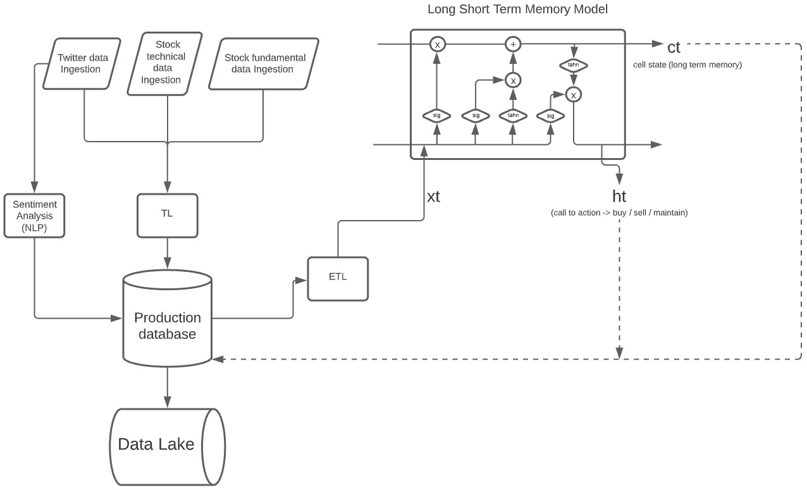

# Algotrader

### (In progress) Deploy of a algorithmic stock trading strategy with a deep learning model (LSTM Keras) 
*Predicting Stock's price movement.*
> The main objectives of this project are: understand advanced deep learning models inner structures; comprehend the whole cycle of the data throughout a model in production.
The deploy of the model is going to be made in AWS and it's going to be orchestraded with airflow.
 

 
 

*I'm first developing a working stage of the project on colab to then gradually, and while learning, move it to AWS in order to simulate a production environment.*

Project built by personal motivation. Accompanied by mentors of the Data Engineering bootcamp at [How Bootcamps](https://howedu.com.br/cohort/engenharia-de-dados/?gclid=Cj0KCQiAmpyRBhC-ARIsABs2EAqENMpiYYuGn9bKLYI-btMdAS8R3be_UNzxraVEg4tDxT1Rkka8vRAaAsG5EALw_wcB).
 

IAC built on top of [André Sionek's repository](https://github.com/andresionek91/airflow-autoscaling-ecs)

